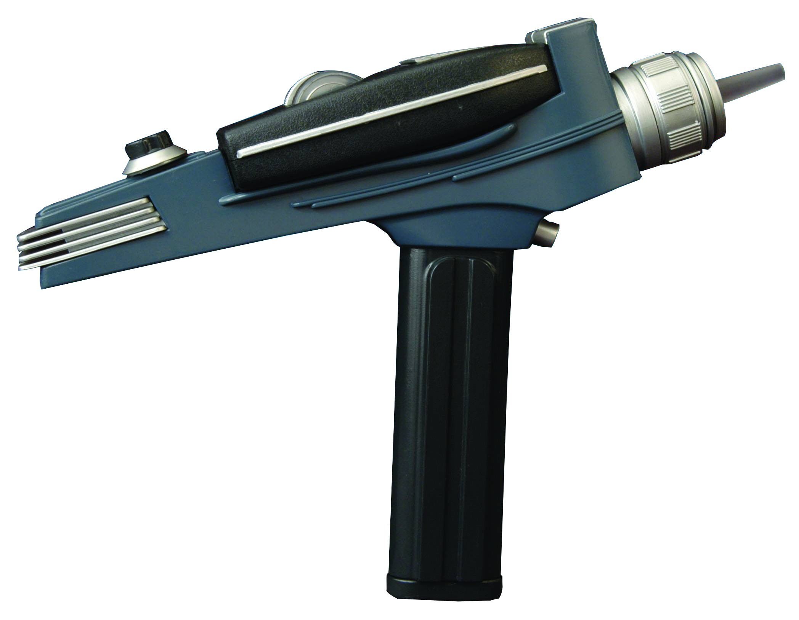
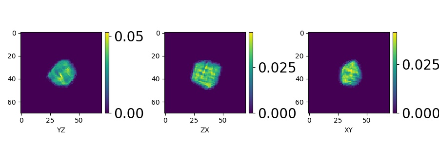
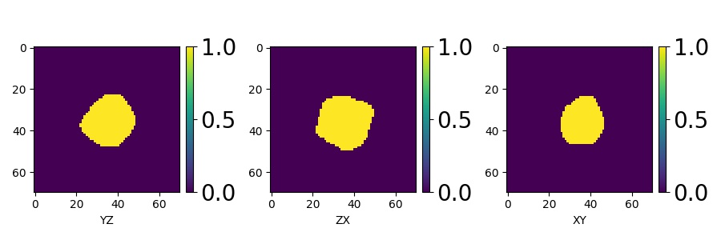
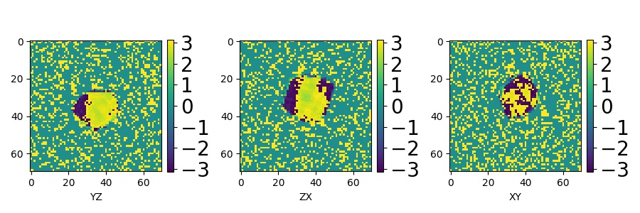
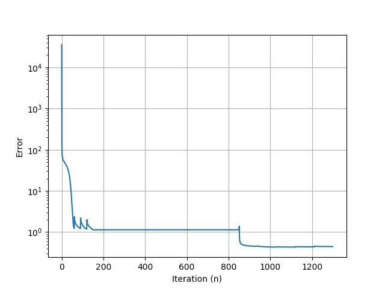
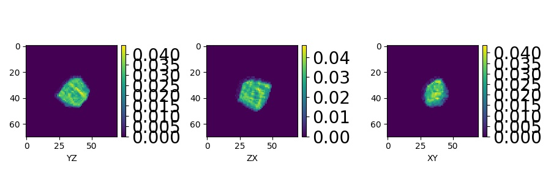
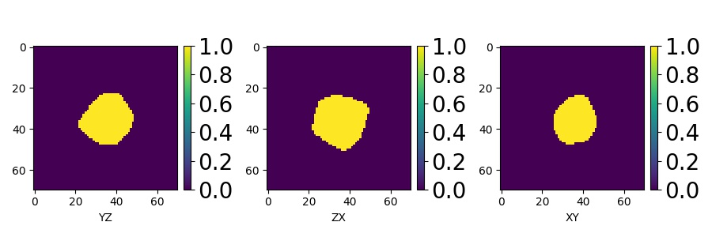
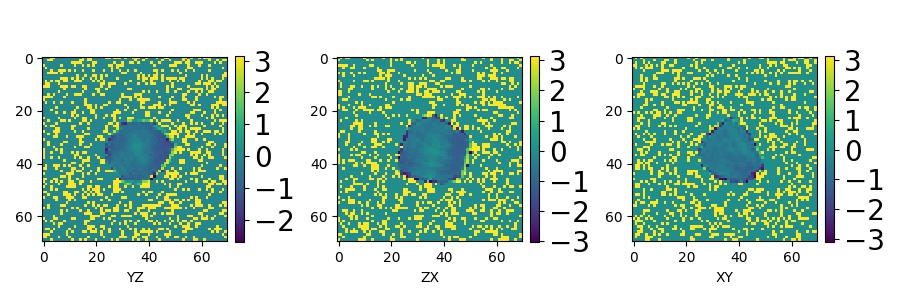

# Phase retrieval with Python: `Phaser`



## Created by: Siddharth Maddali

### This presentation, along with the Python modules, is available at:<br/>
https://github.com/siddharth-maddali/Phaser

# UPDATES

   - Refactored to use Tensorflow 2.x (`master` branch), older code still available in `tensorflow-1.x` branch.
       - Code base is much more compact.
       - Works much faster than the 1.x module (1.x used to offer ~8x speedup compared to CPU, 2.x offers ~20x!)
   - Only core libraries differ for CPU and GPU implementations.
   - ER, HIO and SF are implemented with the same high-level plugins (implemented through mixins).
   - Recipe strings now work on the GPU as well as CPU.

   # Introduction
   - Basic Python tutorial of module `Phaser` for BCDI phase retrieval.

   - Contains diffraction geometry modules for the 34-ID-C setup at the Advanced Photon Source.
       - Can be adapted to other geometries, please open an issue/feature request if you need this done.

   - Modular, much simpler to use and modify than currently used Matlab legacy code.

   - Current dependencies (apart from standard modules like `time` and `functools`):
       - `numpy>=1.17.1` (linear algebra)
       - `scipy>=1.4.1` (advanced algorithms, reading Matlab files)
       - `tqdm>=4.41.1` (for progress bar displays)
       - `tensorflow>=2.1.0` (for GPU compatibility)
       - `matplotlib>=3.0.3` (plotting)
       - NOTES: 
           - These module versions are based on my current environment state. Feel free to try with earlier versions.
           - All modules can be installed in the usual way: `pip install <module>`.
           - the `tensorflow 1.x`-compatible library is available on branch `tensorflow-1.x` of this repo.
       

# Recommended Python setup
   - Preferably GNU/Linux or Mac (I can't help much with Windows).

   - **Option 1**: Python running in a virtual environment (`virtualenv`).
       - Recommended setup for Tensorflow.
       - Install instructions [here](https://www.tensorflow.org/install/install_linux#InstallingVirtualenv).

   - **Option 2**: Anaconda - very fast, Intel's Math Kernel Library (MKL) for numerical backend.
       - Sometimes does not play wellwith older versions of Tensorflow 1.x (no guarantees for 2.x).
       - Install instructions [here](https://www.digitalocean.com/community/tutorials/how-to-install-the-anaconda-python-distribution-on-ubuntu-18-04).

   - Once Python is installed, the iPython shell can be started from the Bash shell with:
       ```
       $ ipython --pylab
       ```
   - All code runs in iPython shell.
       - Line-by-line
       - Running a script:
       ```python
       %run -i <filename>.py # don't forget the %
       ```

# Initial setup

## Module imports


```python
import numpy as np

# import custom modules
import Phaser as ph
import ExperimentalGeometry as exp # currently implements the motors at 34-ID-C
import TilePlot as tp

# plotting 
import matplotlib.pyplot as plt
from matplotlib.colors import LogNorm


# Module to read Matlab .mat files
import scipy.io as sio
```


```python
# this has no effect in the iPython shell, to be used in the Jupyter notebook only.
%matplotlib notebook
```

## Loading data set into Python


```python
dataset = sio.loadmat( 'data.mat' )
print( dataset.keys() )
    # NOTE: if you opened this file in Matlab,
    # you'd see only the 'data' variable in the workspace.
    
data = dataset[ 'data' ] # the 3D data is now a numpy array.
print( 'Array size = ', data.shape )
```

    dict_keys(['__globals__', 'data', '__version__', '__header__'])
    Array size =  (128, 128, 70)


## Pre-processing the dataset

Assumes that the following are already done:
   1. Stray scattering removed
   1. White-field correction done
   1. Background/hot pixels taken care of


```python
# If necessary, trim the dataset to even dimensions 
# by removing the last image in the stack. Typically 
# this is not necessary for in-plane dimensions since 
# detectors are usually even-pixeled.

# data = data[:,:,:-1]
print( 'Array size = ', data.shape )

maxHere = [ n[0] for n in np.where( data==data.max() ) ]
print( 'Bragg peak initially at: ', maxHere )

# Now centering Bragg peak in the array. If this is not done, you will see 
# a phase ramp in the final reconstruction.
for n in [ 0, 1, 2 ]: 
    data = np.roll( data, data.shape[n]//2 - maxHere[n], axis=n )
    
maxHereNow = [ n[0] for n in np.where( data==data.max() ) ]
print( 'Bragg peak now at: ', maxHereNow )
```

    Array size =  (128, 128, 70)
    Bragg peak initially at:  [69, 71, 38]
    Bragg peak now at:  [64, 64, 35]


## Creating initial support for phase retrieval
   - This gets updated with a shrinkwrap algorithm
   - Initial support should never be bigger than $1/3$ of array size.


```python
shp = data.shape
supInit = np.zeros( shp )
supInit[ #   // means integer division in Python3, as opposed to /, the usual floating point division
    ( shp[0]//2 - shp[0]//6 ):( shp[0]//2 + shp[0]//6 ), 
    ( shp[1]//2 - shp[1]//6 ):( shp[1]//2 + shp[1]//6 ), 
    ( shp[2]//2 - shp[2]//6 ):( shp[2]//2 + shp[2]//6 )
] = 1.
```

# CPU tutorial 
## Create a phase retrieval solver object for CPU


```python
PR = ph.Phaser( 
    modulus=np.sqrt( data ), 
    support=supInit.copy() 
        # TODO: remove this; automatically initialize support inside
)
```

## Shrinkwrap
Implemented in the method `PR.Shrinkwrap( sigma, thresh )`. 
   - Object modulus is convolved with a Gaussian (std deviation `sigma`)
   - Thresholded to fraction `thresh` of the maximum value.

## Example recipe for phase retrieval
   - 150 iterations of error reduction (ER), with support-updating every 30 iterations
   - 300 iterations of hybrid input-output (HIO)
   - 100 iterations of solvent-flipping (SF) with support-update every 25 iterations
   - 300 iterations of hybrid input-output (HIO)
   - 450 iterations of ER again, with support-updating every 90 iterations


```python
sigma = np.linspace( 5., 3., 5 )    #
for sig in sigma:                   #  150 iters. of error reduction
    PR.ER( 30, show_progress=True ) #  with shrinkwrap every 30 iters.
    PR.Shrinkwrap( sig, 0.1 )       #
    
PR.HIO( 300, show_progress=True )   #  300 iterations of hybrid I/O

sigma = np.linspace( 3., 2., 4 )
for sig in sigma:                   #
    PR.SF( 25, show_progress=True ) #  100 iterations of solvent flipping, 
    PR.Shrinkwrap( sig, 0.1 )       #  shrinkwrap every 25 iterations.
    
PR.HIO( 300, show_progress=True )   #  300 iterations of hybrid I/O

sigma = np.linspace( 2., 1., 5 )
for sig in sigma:                   #
    PR.ER( 90, show_progress=True ) #  450 iterations of error reduction, 
    PR.Shrinkwrap( sig, 0.1 )       #  shrinkwrap every 90 iterations.
```

     ER: 100%|██████████| 30/30 [00:07<00:00,  3.91it/s]
     ER: 100%|██████████| 30/30 [00:07<00:00,  4.21it/s]
     ER: 100%|██████████| 30/30 [00:07<00:00,  4.10it/s]
     ER: 100%|██████████| 30/30 [00:07<00:00,  4.08it/s]
     ER: 100%|██████████| 30/30 [00:07<00:00,  4.02it/s]
    HIO: 100%|██████████| 300/300 [01:10<00:00,  4.26it/s]
     SF: 100%|██████████| 25/25 [00:05<00:00,  4.56it/s]
     SF: 100%|██████████| 25/25 [00:05<00:00,  4.68it/s]
     SF: 100%|██████████| 25/25 [00:05<00:00,  4.55it/s]
     SF: 100%|██████████| 25/25 [00:05<00:00,  4.45it/s]
    HIO: 100%|██████████| 300/300 [01:11<00:00,  4.20it/s]
     ER: 100%|██████████| 90/90 [00:21<00:00,  4.14it/s]
     ER: 100%|██████████| 90/90 [00:21<00:00,  4.15it/s]
     ER: 100%|██████████| 90/90 [00:21<00:00,  4.13it/s]
     ER: 100%|██████████| 90/90 [00:22<00:00,  4.09it/s]
     ER: 100%|██████████| 90/90 [00:21<00:00,  4.16it/s]


## Extracting image and support from black box


```python
PR.Retrieve() # centers the compact object in array
img = PR.finalImage
sup = PR.finalSupport
```

## Visualizing the result

### Scatterer amplitude

```python
fig, im, ax = tp.TilePlot( 
    ( 
        np.absolute( img[64,29:99,:] ), 
        np.absolute( img[29:99,64,:] ), 
        np.absolute( img[29:99,29:99,30] )                                         
    ),
    ( 1, 3 ), 
    ( 9, 3 )
)

# fig.suptitle( 'Amplitude' )
ax[0].set_xlabel( 'YZ' )
ax[1].set_xlabel( 'ZX' )
ax[2].set_xlabel( 'XY' )

fig.savefig( 'images/scattererAmp.jpg' )
```



### Scatterer support

```python
fig, im, ax = tp.TilePlot( 
    ( 
        sup[64,29:99,:], sup[29:99,64,:], sup[29:99,29:99,30]
                                                 
    ), 
    ( 1, 3 ), 
    ( 9, 3 )
)

# fig.suptitle( 'Support' )
ax[0].set_xlabel( 'YZ' )
ax[1].set_xlabel( 'ZX' )
ax[2].set_xlabel( 'XY' )

fig.savefig( 'images/scattererSup.jpg')
```



### Scatterer phase

```python
fig, im, ax = tp.TilePlot( 
    ( 
        np.angle( img[64,29:99,:] ), 
        np.angle( img[29:99,64,:] ), 
        np.angle( img[29:99,29:99,30] )
                                                 
    ), 
    ( 1, 3 ), 
    ( 9, 3 )
)

# fig.suptitle( 'Phase' )
ax[0].set_xlabel( 'YZ' )
ax[1].set_xlabel( 'ZX' )
ax[2].set_xlabel( 'XY' )

fig.savefig( 'images/scattererPhs.jpg')
```



### Reconstruction error

```python
plt.figure()
plt.semilogy( PR.Error() )
plt.grid()
plt.xlabel( 'Iteration (n)' )
plt.ylabel( 'Error' )

plt.savefig( 'images/reconError.jpg' )
```



### Transforming from array to real-world coordinates
   - Matlab has better isosurface plotting than Python (for now)
   - Dump transformed object to `.mat` file, then view in Matlab.

`exp.ScatteringGeometry` is a black box that computes the scattering geometry given the experimental parameters in use at Beamline 34-ID-C of the Advanced Photon Source, in the following manner:

```python
sg = exp.ScatteringGeometry( 
    arm=0.65,                     # sample-detector distance, meters
    dtheta=0.01,                  # rocking curve step, degrees
    recipSpaceSteps=data.shape,   # pixel span of data set
    gamma=9.6035,                 # degrees
    delta=33.18675                # degrees
)

Breal, Brecip = sg.getSamplingBases() # get sampling basis into array like this.
```

...then you can dump all the computations into a `.mat` file, and use Matlab's isosurface plotting capabilities (the plotting script `plotParticle.m` is available in this repo).

**Note**: The `ExperimentalGeometry` module is specific to the experimental setup at 34-ID-C end station of the Advanced Photon Source (used for Bragg coherent diffractive imaging). 
For the appropriate module corresponding to other BCDI experiments at the APS (say, 1-ID-E), please [open an issue](https://github.com/siddharth-maddali/Phaser/issues) and I'll see if I can arrange for a module.

```python
sio.savemat( 
    'phasingResult-2.mat', 
    { 
        'img':img, 
        'sup':sup, 
        'data':data, 
        'Breal':Breal, 
        'Brecip':Brecip
    }
)
```

# Recipe strings

`Phaser` can also run an entire phase retrieval recipe by parsing "recipe strings", which are simply Python strings that encode a phase retrieval recipe. 
See `RecipeParser.py` documentation for more details.

   - Recipe string for 30 iterations of ER is simply:<br/>`'ER:30'`.  
   
   - Recipe string for 100 ER followed by 25 HIO, followed by 40 SF:<br/>`'ER:100+HIO:25+SF:40'`
   
   - Shrinkwrap recipe string format:<br/>`'SR:<sigma>:<thresh>'`

## Generating the recipe string for the CPU recipe above


```python
recipestr1 = '+'.join( [ 'ER:30+SR:%.2f:0.1'%sig for sig in np.linspace( 5., 3., 5 ) ] )
recipestr2 = '+'.join( [ 'SF:25+SR:%.2f:0.1'%sig for sig in np.linspace( 3., 2., 4 ) ] )
recipestr3 = '+'.join( [ 'ER:90+SR:%.2f:0.1'%sig for sig in np.linspace( 2., 1., 5 ) ] )
recipestr = '+HIO:300+'.join( [ recipestr1, recipestr2, recipestr3 ] )
print( recipestr )
```

    ER:30+SR:5.00:0.1+ER:30+SR:4.50:0.1+ER:30+SR:4.00:0.1+ER:30+SR:3.50:0.1+ER:30+SR:3.00:0.1+HIO:300+SF:25+SR:3.00:0.1+SF:25+SR:2.67:0.1+SF:25+SR:2.33:0.1+SF:25+SR:2.00:0.1+HIO:300+ER:90+SR:2.00:0.1+ER:90+SR:1.75:0.1+ER:90+SR:1.50:0.1+ER:90+SR:1.25:0.1+ER:90+SR:1.00:0.1


## Running the recipe using the string

Here, starting with a new `Phaser` object and use the `runRecipe` method...


```python
PR_alt = ph.Phaser( 
    modulus=np.sqrt( data ), 
    support=supInit.copy() 
)
PR_alt.runRecipe( recipestr )
```

... and so on, to get the same result!

   - Recipe strings are used in parallelized phase retrieval.
   - `tqdm`-enabled progress bars are disabled by default for this mode of operation.
   - Recipe strings can work with CPU as well as GPU without loss of generality.

# GPU tutorial


```python
PR2 = ph.Phaser( 
    modulus=np.sqrt( data ), 
    support=supInit.copy(), 
    gpu=True
).gpusolver
```

## Recipe for GPU phase retrieval (identical to earlier CPU recipe)
   - 150 iterations of error reduction (ER), with support-updating every 30 iterations
   - 300 iterations of hybrid input-output (HIO)
   - 100 iterations of solvent flipping (SF) with support-update every 25 iterations
   - 300 iterations of hybrid input-output (HIO)
   - 450 iterations of ER again, with support-updating every 90 iterations


```python
sigma = np.linspace( 5., 3., 5 )    #
for sig in sigma:                   #  150 iters. of error reduction
    PR2.ER( 30, show_progress=True ) #  with shrinkwrap every 30 iters.
    PR2.Shrinkwrap( sig, 0.1 )       #
    
PR2.HIO( 300, show_progress=True )   #  300 iterations of hybrid I/O

sigma = np.linspace( 3., 2., 4 )
for sig in sigma:                   #
    PR2.SF( 25, show_progress=True ) #  100 iterations of solvent flipping, 
    PR2.Shrinkwrap( sig, 0.1 )       #  shrinkwrap every 25 iterations.
    
PR2.HIO( 300, show_progress=True )   #  300 iterations of hybrid I/O

sigma = np.linspace( 2., 1., 5 )
for sig in sigma:                   #
    PR2.ER( 90, show_progress=True ) #  450 iterations of error reduction, 
    PR2.Shrinkwrap( sig, 0.1 )       #  shrinkwrap every 90 iterations.
```

     ER: 100%|██████████| 30/30 [00:00<00:00, 49.68it/s]
     ER: 100%|██████████| 30/30 [00:00<00:00, 74.28it/s]
     ER: 100%|██████████| 30/30 [00:00<00:00, 76.34it/s]
     ER: 100%|██████████| 30/30 [00:00<00:00, 73.91it/s]
     ER: 100%|██████████| 30/30 [00:00<00:00, 74.06it/s]
    HIO: 100%|██████████| 300/300 [00:03<00:00, 76.66it/s]
     SF: 100%|██████████| 25/25 [00:00<00:00, 78.69it/s]
     SF: 100%|██████████| 25/25 [00:00<00:00, 78.61it/s]
     SF: 100%|██████████| 25/25 [00:00<00:00, 76.29it/s]
     SF: 100%|██████████| 25/25 [00:00<00:00, 78.08it/s]
    HIO: 100%|██████████| 300/300 [00:03<00:00, 78.58it/s]
     ER: 100%|██████████| 90/90 [00:01<00:00, 81.07it/s]
     ER: 100%|██████████| 90/90 [00:01<00:00, 78.37it/s]
     ER: 100%|██████████| 90/90 [00:01<00:00, 78.90it/s]
     ER: 100%|██████████| 90/90 [00:01<00:00, 73.15it/s]
     ER: 100%|██████████| 90/90 [00:01<00:00, 81.19it/s]


## Extracting image and support from black box `PR2`


```python
PR2.Retrieve()
img2 = PR2.finalImage
sup2 = PR2.finalSupport
```

## Visualizing the result

### Scatterer amplitude

```python
fig, im, ax = tp.TilePlot( 
    ( 
        np.absolute( img2[64,29:99,:] ), 
        np.absolute( img2[29:99,64,:] ), 
        np.absolute( img2[29:99,29:99,30] )
                                                 
    ), 
    ( 1, 3 ), 
    ( 9, 3 )
)

# fig.suptitle( 'Amplitude' )
ax[0].set_xlabel( 'YZ' )
ax[1].set_xlabel( 'ZX' )
ax[2].set_xlabel( 'XY' )
fig.savefig( 'images/scattererAmp_gpu.jpg')
```



### Scatterer Support

```python
fig, im, ax = tp.TilePlot( 
    ( 
        sup2[64,29:99,:], sup2[29:99,64,:], sup2[29:99,29:99,30]
                                                 
    ), 
    ( 1, 3 ), 
    ( 9, 3 )
)

# fig.suptitle( 'Support' )
ax[0].set_xlabel( 'YZ' )
ax[1].set_xlabel( 'ZX' )
ax[2].set_xlabel( 'XY' )
fig.savefig( 'images/scattererSup_gpu.jpg')
```



### Scatterer phase

```python
fig, im, ax = tp.TilePlot( 
    ( 
        np.angle( img[64,29:99,:] ), 
        np.angle( img[29:99,64,:] ), 
        np.angle( img[29:99,29:99,30] )
                                                 
    ), 
    ( 1, 3 ), 
    ( 9, 3 )
)

# fig.suptitle( 'Phase' )
ax[0].set_xlabel( 'YZ' )
ax[1].set_xlabel( 'ZX' )
ax[2].set_xlabel( 'XY' )
fig.savefig( 'images/scattererPhs_gpu.jpg')
```



# Upcoming features
   - A simple partial coherence correction module
